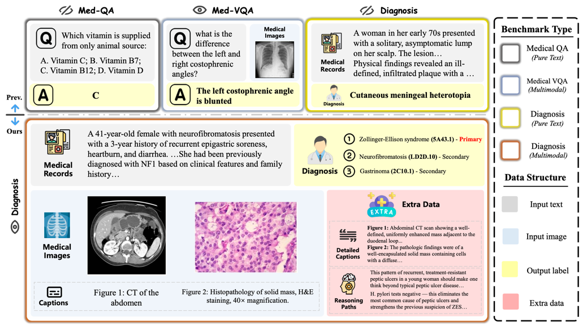

<div align="center">

# OpenDxBench: Evaluating Multimodal Diagnostic Reasoning in Clinical Practice

[](https://arxiv.org/)  [](https://huggingface.co/datasets/thomasweiX/OpenDxBench)  [](https://opendxbench.github.io/leaderboard.html)

</div>


## Overview

**OpenDxBench** is the first benchmark dedicated to multimodal diagnostic reasoning. Unlike prior datasets that are often limited to factoid-style questions or text-only input, OpenDxBench integrates clinical narratives, medical images, and ICD-11–coded diagnoses, creating tasks that closely reflect real-world clinical practice.
<p align="center">
   
</p>

## Usage
### 1. Clone the Repository:

```
git clone https://github.com/thomaswei-cn/OpenDxBench.git
cd OpenDxBench/eval
```

### 2. Install Dependencies:

```
pip install -r requirements.txt
```

### 3. Download the Dataset:
```
huggingface-cli download <datastet>
```

### 4. Sign up for ICD-API:
Please sign up for an account at [ICD API official website](https://icd.who.int/icdapi) to obtain CLIENT_ID and CLIENT_SECRET. 
Then, copy your CLIENT_ID and CLIENT_SECRET to `config.py`.

### 5. Inference and evaluation:

```
python run_pipeline.py \
--benchmark_jsonl /path/to/benchmark.jsonl \
--models gpt-4.1 gpt-4o \
--res_dir ./results/ \
--parallel \
--max_workers 8 \
--max_retries 3 \
--api_key your_openai_api_key 
```
### 6. View Results

The evaluation results are stored in **`res_dir/summary`**, containing two Excel files:  

- **Top-5 evaluation**
- **Top-10 evaluation**

The meaning of the column names in each file is as follows:

| Column                        | Description |
|--------------------------------|-------------|
| `icd`                          | ICD-11 accuracy |
| `sim`                          | Semantic accuracy |
| `avg`                          | Average of `icd` and `sim` |
| `primary`                      | Evaluation based on **primary diagnosis** only |
| `complete`                     | Evaluation requiring **complete diagnosis coverage** |
| `n_all`                        | Total number of cases |
| `valid_preds_count`            | Number of cases with valid predictions (models may sometimes fail to generate outputs that satisfy the prompt) |
| `valid_standardized_preds_count` | Number of valid predictions successfully mapped to ICD-11 codes |
## Citation

If you find our work helpful, please use the following citation.

```bibtex
@article{
}
```